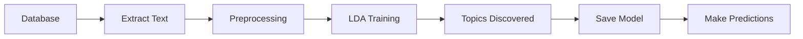

# EPA Analytics

> Employer Review Analytics Platform — NLP-powered analysis of employer reviews using LDA Topic Modeling and Sentiment Analysis.

Parts of this project were developed with the assistance of AI tools (GitHub Copilot, Claude Sonnet 4.6). The generated content was reviewed and integrated by the author.


## 📋 Table of Contents

- [Knowledge Repository](#-knowledge-repository)
- [Requirements / Dependencies](#-requirements--dependencies)
- [Quick Start](#-quick-start)
- [Installation Guide](#-installation-guide)
- [Setup](#-setup)
- [Project Structure](#-project-structure)
- [LDA Topic Modeling](#-lda-topic-modeling)
- [Technology Stack](#️-technology-stack)

## 📚 Knowledge Repository

Here you can find all central resources and tools of the project:

| Resource | Description | Link |
|----------|-------------|------|
| **Figma** | UI/UX Prototype & Design Documentation | [Figma → Prototype](https://www.figma.com/design/J6DpLLKbuyFah1hdt6lgm3/Prototype?node-id=0-1&t=AheLdS2Z58LItjWB-0) |

---

## ⚡ Quick Start

```bash
# Start backend
cd backend
uv sync
uv run uvicorn main:app --reload

# Start frontend (new terminal)
cd frontend
npm install
npm run dev
```

**Backend:** `http://localhost:8000` | **API Docs:** `http://localhost:8000/docs`  
**Frontend:** `http://localhost:5173`

## 📋 Requirements / Dependencies

To run the project locally, you need:

* **Python** >= 3.13
* **Node.js** v20+
* **npm** (comes with Node.js)
* **uv** → https://docs.astral.sh/uv/ (recommended for Python)
* **Supabase Account** (for database)
* IDE of your choice, preferably **VSCode**

### Python Packages (Backend):
* `fastapi` - Web Framework
* `gensim` - Topic Modeling (LDA)
* `transformers` >= 5.1 - ML-based Sentiment Analysis (German BERT)
* `torch` >= 2.10 - PyTorch Backend for Transformers
* `pandas` - Data Processing
* `supabase` - Database Client
* `statsmodels` - Statistical Analysis

### npm Packages (Frontend):
* `@radix-ui/react-checkbox` - Checkbox Component
* `@radix-ui/react-label` - Label Component
* `@radix-ui/react-dialog` - Dialog/Modal Component
* `@radix-ui/react-select` - Select/Dropdown Component
* `@radix-ui/react-dropdown-menu` - Dropdown Menu Component
* `@radix-ui/react-popover` - Popover Component
* `@radix-ui/react-separator` - Separator Component
* `cmdk` - Command Menu Component
* `recharts` - Chart Library
* `lucide-react` - Icon Library
* `tailwindcss` - CSS Framework
* `html2canvas` + `jspdf` - PDF Export

## 📦 Installation Guide

A detailed step-by-step guide for setting up the project can be found in **[INSTALLATION.md](./INSTALLATION.md)**.

It covers:
- Prerequisites & Software Installation
- Backend & Frontend Setup (with `uv` and `pip`)
- Configuring Environment Variables
- Verifying the Installation
- Common Problems & Solutions

## 🚀 Setup

### Backend (FastAPI)

If `uv` is installed, open the terminal and run:

```bash
cd backend
uv sync
```

Then select the `.venv` folder as the Python Interpreter for the project.

**Alternative without uv:** If you prefer classic `pip`:

```bash
cd backend
python -m venv .venv
source .venv/bin/activate  # On macOS/Linux
# .venv\Scripts\activate  # On Windows
pip install -r requirements.txt
```

The backend server can be started as follows:

```bash
uv run uvicorn main:app --reload
```

or with classic Python:

```bash
python -m uvicorn main:app --reload
```

**Backend runs at:** `http://localhost:8000`  
**API Documentation:** `http://localhost:8000/docs` (Swagger UI)

### Frontend (React + Vite)

If `node` is installed, open the terminal and run:

```bash
cd frontend
npm install
```

Then start the frontend dev server:

```bash
npm run dev
```

**Frontend runs at:** `http://localhost:5173`

## 🔧 Environment Variables

Create a `.env` file in the `backend/` folder:

```env
# Supabase Configuration
SUPABASE_URL=your-supabase-url
SUPABASE_KEY=your-supabase-key

# Optional: API Configuration
API_HOST=0.0.0.0
API_PORT=8000
```

**Important:** The `.env` file is listed in `.gitignore` and will not be committed to the repository!

## 💡 Tips

* It's best to have **2 terminal sessions** open to run backend and frontend simultaneously!
* Make sure the `.env` file in the backend folder is correctly configured
* For a production build of the frontend: `npm run build`
* Clear cache: `find . -type d -name "__pycache__" -exec rm -rf {} +`
* Delete old models: `cd backend/models && rm -f lda_model_*.* 2>/dev/null`

### Performance Tips (Version 2.1):
* **Dashboard loading slowly?** → Hard-Reload (Cmd+Shift+R / Ctrl+Shift+F5)
* **Check API calls**: Browser DevTools → Network Tab → Filter "Fetch/XHR"
* **Analyze re-renders**: React DevTools → Profiler Tab
* **Caching enabled**: CompanySearchSelect automatically caches after first load

### Topic Detail Modal Features:
* **Collapsible view controls:** Click "Customize View" to show/hide elements
* **Smart layout:** Charts automatically expand when others are hidden
* **5 customizable sections:**
  - ✅ Statistics (Frequency, Rating, Sentiment)
  - ✅ Timeline Chart (Rating over time)
  - ✅ Sentiment Chart (Gauge with percentage display)
  - ✅ Typical Statements (Top 3 Statements)
  - ✅ Sample Review (with navigation)
* **Time Filter:** Choose between All Time, 1 Year, 6 Months, 3 Months, or 1 Month
* **Review Navigation:** Click on statements to see the full review

## 📁 Project Structure

```
epa-analytics/
├── backend/                      # FastAPI Backend
│   ├── main.py                  # Main entry point
│   ├── config.py                # Configuration
│   ├── pyproject.toml           # Python Dependencies (uv)
│   ├── examples_statistical_usage.py # Statistics examples
│   │
│   ├── database/                # Database connections (Supabase)
│   │   └── supabase_client.py
│   │
│   ├── migrations/              # SQL migrations
│   │   ├── 001_create_candidates_table.sql
│   │   ├── 002_create_employee_table.sql
│   │   ├── 003_create_companies_table.sql
│   │   └── 004_add_company_references.sql
│   │
│   ├── models/                  # Machine Learning Models
│   │   ├── lda_topic_model.py  # LDA Topic Modeling
│   │   ├── sentiment_analyzer.py # Sentiment Analysis
│   │   └── saved_models/       # Trained models
│   │
│   ├── services/                # Business Logic Services
│   │   ├── excel_service.py               # Excel Import/Export
│   │   ├── topic_model_service.py         # Topic Modeling DB Service
│   │   ├── topic_rating_service.py        # Topic-Rating Analysis
│   │   ├── topic_average_rating_service.py # Topic Average Ratings
│   │   ├── statistical_enrichment.py      # Statistical Enrichment
│   │   └── statistical_validator.py       # Statistical Validation
│   │
│   ├── routes/                  # API Endpoints
│   │   ├── analytics.py        # Analytics API (12 Endpoints)
│   │   ├── companies.py        # Company Management (9 Endpoints)
│   │   ├── topics.py           # Topic Modeling API (13 Endpoints)
│   │   └── upload.py           # File Upload
│   │
│   ├── scripts/                 # Utility Scripts
│   │   ├── train_models.py     # Model Training
│   │   ├── fix_html_entities.py # Text Cleanup
│   │   ├── sweep_num_topics_db.py    # Topic Count Optimization
│   │   └── test_num_topics_compare.py # Topic Comparison Tests
│   │
│   ├── tests/                   # Organized Tests
│   │   ├── topic_modeling/     # Topic Modeling Tests
│   │   ├── sentiment_analysis/ # Sentiment Tests
│   │   └── statistical/        # Statistical Tests
│   │
│   └── examples/                # Examples & Demos
│       ├── topic_modeling_examples.py
│       └── topic_rating_examples.py
│
├── frontend/                    # React/Vite Frontend
│   ├── src/                    # Source Code
│   │   ├── components/         # React Components
│   │   │   ├── CompanySearchSelect.jsx  # Optimized with caching
│   │   │   ├── dashboard/     # Dashboard Components
│   │   │   │   ├── DominantTopicsCard.jsx   # Dominant Topics
│   │   │   │   ├── IndividualReviewsCard.jsx # Individual Reviews
│   │   │   │   ├── TimelineCard.jsx         # React.memo optimized
│   │   │   │   ├── TopicRatingCard.jsx      # React.memo optimized
│   │   │   │   ├── TopicOverviewCard.jsx    # React.memo optimized
│   │   │   │   └── modals/
│   │   │   │       ├── MostCriticalModal.jsx
│   │   │   │       ├── NegativTopicModal.jsx
│   │   │   │       ├── SorceModal.jsx
│   │   │   │       ├── TrendModal.jsx
│   │   │   │       ├── TopicTableModal.jsx    # Topic Table
│   │   │   │       ├── TopicDetailModal.jsx   # Topic Details with Customize View
│   │   │   │       └── ReviewDetailModal.jsx  # Full Review View
│   │   │   └── ui/            # UI Components (shadcn)
│   │   │       ├── badge.tsx
│   │   │       ├── button.tsx
│   │   │       ├── card.tsx
│   │   │       ├── checkbox.jsx
│   │   │       ├── command.tsx
│   │   │       ├── dialog.tsx
│   │   │       ├── dropdown-menu.tsx
│   │   │       ├── input.tsx
│   │   │       ├── label.jsx
│   │   │       ├── popover.tsx
│   │   │       ├── select.tsx
│   │   │       ├── separator.tsx
│   │   │       └── table.tsx
│   │   ├── pages/             # Pages
│   │   │   ├── Dashboard.jsx
│   │   │   ├── Compare.jsx
│   │   │   └── Welcome.jsx
│   │   ├── utils/             # Utility Functions
│   │   │   ├── pdfExport.js   # PDF Export
│   │   │   ├── chartValidator.js # Chart Validation
│   │   │   └── pdf/           # PDF Utilities
│   │   └── lib/               # Utilities
│   │       └── utils.ts
│   ├── public/                # Static Assets
│   └── package.json           # Node.js Dependencies
├── requirements.txt            # Python Dependencies (Project Root)
└── INSTALLATION.md             # Detailed Installation Guide
```

## 🛠️ Technology Stack

### Backend
* **Framework:** FastAPI (modern Python Web API)
* **Server:** Uvicorn (ASGI Server)
* **Database:** Supabase (PostgreSQL)
* **ML/AI:** 
  - Gensim 4.3+ (LDA Topic Modeling)
  - Transformers 5.1+ (ML-based Sentiment Analysis with German BERT)
  - PyTorch 2.10+ (Backend for Transformer models)
  - Lexicon-based Sentiment Analysis (rule-based, fast)
* **Statistics:** Statsmodels 0.14+
* **Data Processing:** Pandas, OpenPyXL
* **Tools:** Python-dotenv, Python-multipart

### Frontend
* **Framework:** React 19
* **Build Tool:** Vite 6
* **Routing:** React Router DOM 7
* **UI Library:** shadcn/ui (Radix UI + Tailwind CSS)
  - Dialog, Select, Dropdown Menu, Popover, Separator
  - Checkbox, Label (for view customization)
  - Badge, Button, Card, Input, Command, Table
* **Charts:** Recharts (Line Charts, Gauge Charts)
* **Icons:** Lucide React (Eye, ChevronDown, ChevronUp, Calendar, etc.)
* **PDF Export:** html2canvas + jsPDF
* **Styling:** Tailwind CSS v4 with Custom Animations
* **Linting:** ESLint

### Dashboard Features
* **Performance Optimizations (Version 2.1):**
  - ⚡ **Parallel Loading**: All KPI data loads simultaneously (~50% faster)
  - 💾 **Caching**: Company list is cached (~80% faster from 2nd load onward)
  - ⏱️ **Debouncing**: Smart search with 300ms delay
  - 🎯 **React.memo**: Optimized re-renders for large components
  - 🔄 **Better Error Handling**: Explicit logging for easier debugging

* **Topic Overview:**
  - Interactive topic table with search functionality
  - Detail view with line chart (rating over time)
  - Gauge chart for sentiment visualization
  - Typical statements and sample reviews
  - Two-level modal interaction (Table → Details)
  - **Customize View:** Toggleable elements with intelligent layout adjustment
  - **Responsive Charts:** Charts automatically expand when others are hidden

### Database Schema
* **Tables:** `candidates`, `employee`, `companies`
* **Features:** Star ratings, text feedback, relational data

## 🤖 LDA Topic Modeling

This project includes a complete **LDA Topic Modeling** integration with **Gensim** for automatic topic extraction from candidate and employee feedback.

### Features

✅ **Automatic Topic Detection** in text data  
✅ **Sentiment Analysis** - Dual-Mode (Lexicon + ML-Transformer)
  - **Lexicon Mode:** Fast, rule-based, no dependencies
  - **Transformer Mode:** ML-based with German BERT, 100% accuracy
✅ **Star Ratings** - Combines text topics with rating data  
✅ **Database Integration** - Direct access to candidate and employee data  
✅ **RESTful API** - 13 endpoints for training, analysis, and prediction  
✅ **Model Persistence** - Save and load trained models  
✅ **German Text Processing** - Optimized stopword list  
✅ **Flexible Analysis** - Individual texts or entire datasets  
✅ **Topic-Rating Correlation** - Understand how different topics are rated  

### Quick Start

1. **Start Backend:**
   ```bash
   cd backend
   uv run uvicorn main:app --reload
   ```

2. **Open API Documentation:**
   ```
   http://localhost:8000/docs
   ```

3. **Train first model:**
   ```bash
   curl -X POST http://localhost:8000/api/topics/train \
     -H "Content-Type: application/json" \
     -d '{"source": "both", "num_topics": 5}'
   ```

### API Endpoints

| Endpoint | Method | Description |
|----------|--------|-------------|
| `/api/topics/status` | GET | Get model status |
| `/api/topics/database/stats` | GET | Database statistics |
| `/api/topics/train` | POST | Train a new model |
| `/api/topics/topics` | GET | Show discovered topics |
| `/api/topics/predict` | POST | Predict topics for text |
| `/api/topics/analyze-record` | POST | Analyze a specific record |
| `/api/topics/analyze/employee-reviews-with-ratings` | GET | Employee reviews with topics, sentiment & ratings |
| `/api/topics/analyze/candidate-reviews-with-ratings` | GET | Candidate reviews with topics, sentiment & ratings |
| `/api/topics/analyze/topic-rating-correlation` | GET | Correlation between topics and ratings |
| `/api/topics/models/list` | GET | List saved models |
| `/api/topics/models/load` | POST | Load a saved model |
| `/api/topics/company/{company_id}/negative-topics` | GET | Negative topics for a company |
| `/api/topics/company/{company_id}/most-critical` | GET | Most critical topics for a company |

### Test Installation

```bash
# Run tests
cd backend
pytest tests/
```

### Run Examples

**Basic Topic Modeling:**
```bash
cd backend
uv run python examples/topic_modeling_examples.py
```

**Topic-Rating Analysis (NEW):**
```bash
cd backend
uv run python examples/topic_rating_examples.py
```

### Examples

- 💡 [`backend/examples/`](backend/examples/) - Examples & Demos
  - `topic_modeling_examples.py` - Basic LDA
  - `topic_rating_examples.py` - Topics + Sentiment + Ratings

### Workflow



### Data Sources

**Candidates Table:**
- `stellenbeschreibung`
- `verbesserungsvorschlaege`

**Employee Table:**
- `jobbeschreibung`
- `gut_am_arbeitgeber_finde_ich`
- `schlecht_am_arbeitgeber_finde_ich`
- `verbesserungsvorschlaege`

### Example Usage

#### Python (Topic-Rating Analysis):
```python
import requests

# Train model
response = requests.post(
    "http://localhost:8000/api/topics/train",
    json={"source": "employee", "num_topics": 5}
)
print(response.json())

# Analyze employee reviews with sentiment & ratings
response = requests.get(
    "http://localhost:8000/api/topics/analyze/employee-reviews-with-ratings",
    params={"limit": 50}
)
analysis = response.json()['analysis']

# Get topic-rating correlation
response = requests.get(
    "http://localhost:8000/api/topics/analyze/topic-rating-correlation"
)
correlation = response.json()['correlation']

for topic in correlation['topics']:
    print(f"Topic {topic['topic_id']}: "
          f"{topic['avg_rating']:.1f}⭐ "
          f"({topic['mention_count']} mentions)")
```

#### cURL:
```bash
# Analyze topics with ratings
curl "http://localhost:8000/api/topics/analyze/topic-rating-correlation"

# Analyze text
curl -X POST http://localhost:8000/api/topics/predict \
  -H "Content-Type: application/json" \
  -d '{"text": "The work-life balance is excellent!", "threshold": 0.1}'
```

### Technical Details

- **LDA Algorithm**: Latent Dirichlet Allocation with Gensim
- **Sentiment Analysis**: Lexicon-based with 100+ German sentiment words
  - Recognizes intensifiers (sehr, extrem, total)
  - Considers negations (nicht, kein, nie)
  - Calculates polarity (-1 to +1) and subjectivity (0 to 1)
- **Preprocessing**: Lowercase, stopword removal, token filtering
- **Language**: Optimized for German texts
- **Parameters**: Configurable topics (2–20), passes, iterations
- **Storage**: Automatic saving of trained models
- **Integration**: Combines topics, sentiment, and star ratings

## 🚨 Common Problems & Solutions

### Backend won't start
```bash
# Port 8000 is in use
lsof -ti:8000 | xargs kill -9
uv run uvicorn main:app --reload
```

### Frontend won't start
```bash
# Missing dependencies
cd frontend
npm install
npm run dev

# Reinstall specific packages (if necessary)
npm install @radix-ui/react-checkbox @radix-ui/react-label
```

### Dashboard loading slowly (Version 2.1 should fix this!)
```bash
# 1. Hard-Reload in browser
# Chrome/Edge: Cmd+Shift+R (Mac) or Ctrl+Shift+F5 (Windows)
# Firefox: Cmd+Shift+R (Mac) or Ctrl+F5 (Windows)

# 2. Clear browser cache
# DevTools → Application → Clear Storage

# 3. Check Network Tab
# DevTools → Network → Check if KPI calls run in parallel
# Should now be ~50% faster!
```

### "Model not trained" Error
```bash
# Train a model first
curl -X POST http://localhost:8000/api/topics/train \
  -H "Content-Type: application/json" \
  -d '{"source": "employee", "num_topics": 5}'
```

### Python Cache Issues
```bash
# Delete all __pycache__ directories
find . -type d -name "__pycache__" -exec rm -rf {} +
```

### Delete old models
```bash
# Free up disk space
cd backend/models
rm -f lda_model_*.* 2>/dev/null
```

### Finding tests after reorganization
```bash
# Tests are now organized in backend/tests/
pytest backend/tests/                    # All tests
pytest backend/tests/topic_modeling/     # Topic modeling only
pytest backend/tests/sentiment_analysis/ # Sentiment only
pytest backend/tests/statistical/        # Statistical only
```

## 📚 Further Resources

### Project Documentation
- **Installation Guide**: [INSTALLATION.md](./INSTALLATION.md)
- **Test Documentation**: [backend/tests/](./backend/tests/)
- **Examples**: [backend/examples/](./backend/examples/)

### API & Tools
- **API Documentation**: http://localhost:8000/docs (Swagger UI)
- **Supabase**: https://supabase.com/docs
- **FastAPI**: https://fastapi.tiangolo.com
- **React**: https://react.dev
- **Gensim**: https://radimrehurek.com/gensim/
- **Recharts**: https://recharts.org/

## 👥 Team

Vaios Pechlevanidis

## 📄 License

This project is **not Open Source**.

**Usage & Licensing**

Any use, reuse, reproduction, or licensing of this project — in whole or in part — requires the explicit written permission of the author.

This applies in particular to:
- commercial use
- distribution to third parties
- publication or inclusion in other projects
- modification and further development

Contact for inquiries: **Vaios Pechlevanidis** – pechlevanidis.vaios@gmail.com
